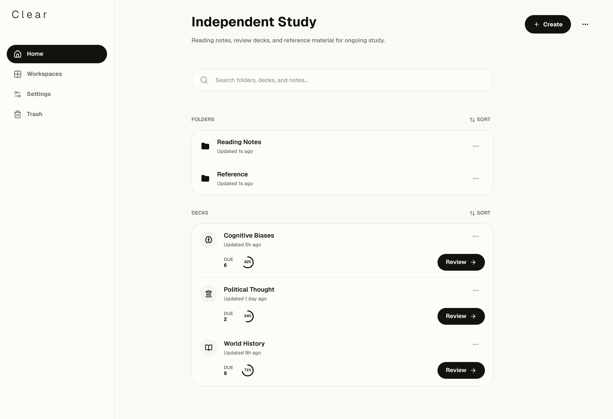

<p align="center">
  
</p>



<p align="center">
  <strong>Local-first spaced repetition for focused study</strong>
</p>

Clear is a desktop study app for people who want their learning workflow to
stay calm, focused, and organized. It brings workspaces, decks, notes, search,
and review sessions into one local-first app, so study material stays close to
the review loop instead of being scattered across documents, browser tabs, and
flashcard tools.

> [!WARNING]
> 🚧 **Active early development.**
>
> The Rust backend API is still under active development, so some functionality
> may be incomplete and behavior may change before the first stable release.

## Current status

Today, the app is usable as a local UI prototype and development target. The
study workflow, structure, and review surfaces are already present, while the
Rust backend API is still under active development.

## Features

- **Workspaces for each study context**: keep courses, research areas, and
  long-running projects separate.
- **Notes, folders, and decks**: organize material from broad topics down to
  concrete review prompts.
- **Basic and cloze cards**: create direct recall cards and inline deletion
  cards for dense concepts.
- **Markdown authoring**: write and edit study material in a lightweight,
  readable format.
- **Fast search**: find folders, decks, and notes without leaving the current
  study context.
- **Focused review sessions**: move through cards with reveal, grading, and
  session summaries built for daily repetition.

## Getting started

Prerequisites:

- Node.js 22+
- pnpm 11+
- Rust and Cargo 1.96+
- Platform-specific Tauri 2 [prerequisites](https://v2.tauri.app/start/prerequisites/) for your operating system

Install dependencies from the repository root:

```bash
pnpm install
```

If you plan to run the browser-backed UI tests or Storybook browser checks locally, install Chromium once:

```bash
pnpm setup:ui
```

If you change the UI API client or routes, regenerate the checked-in outputs with:

```bash
pnpm codegen:ui
```

## Run in mock mode

This is the fastest way to explore the UI. It runs Vite with in-browser mock
services, so no backend process is required.

```bash
VITE_SERVICE_MODE=mock pnpm dev:ui
```

Open `http://localhost:5173`.

## Web mode with mock API

Use this mode to exercise the generated API client against the local mock API
server. Run both commands from the repository root in separate terminals.

Terminal 1:

```bash
pnpm dev:mock-api
```

The mock API listens on `http://127.0.0.1:4010` by default and persists state
to `api/mock-server/.mockapi-runtime/db.json`.

Terminal 2:

```bash
VITE_SERVICE_MODE=web VITE_CLEAR_API_BASE_URL=http://127.0.0.1:4010/api/v1 pnpm dev:ui
```

The UI calls the mock API directly through `VITE_CLEAR_API_BASE_URL`. To point
at another API, set this variable to that API's `/api/v1` base URL.

## Desktop mode with Tauri

Use this mode when working on the desktop shell and native integration.

```bash
pnpm dev:tauri
```

## Project structure

- `ui/`: React and Vite app with routes, features, shared UI, and runtime
  adapters.
- `api/mock-server/`: generated mock API used for web-mode development.
- `rust/crates/`: shared Rust crates for domain errors and migration support.
- `rust/tauri/`: Tauri shell and desktop bootstrap command.

## Quality checks

Run the UI test suite from the repository root:

```bash
pnpm test:ui
```

Additional UI, Storybook, and Rust checks are available through the root
`package.json` scripts when needed.
